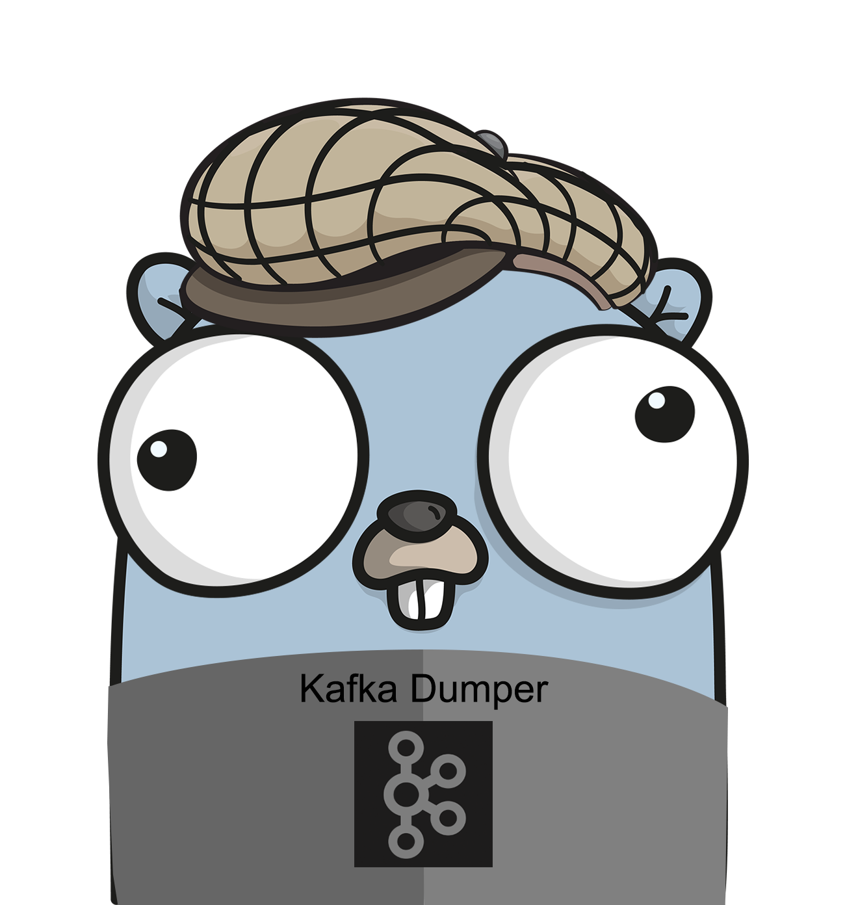

<p align="center"></p>
<p align="center">
    <a href="https://travis-ci.org/oleg-balunenko/kafka-dump"></img></a>
    <a href="https://goreportcard.com/report/github.com/oleg-balunenko/kafka-dump"></img></a>
   <a href="https://coveralls.io/github/oleg-balunenko/kafka-dump?branch=master"></img></a>
   <a href="https://sonarcloud.io/dashboard?id=kafka-dump">
    <a href="https://codecov.io/gh/oleg-balunenko/kafka-dump">
  
</a></img></a> <a href="https://www.codefactor.io/repository/github/oleg-balunenko/kafka-dump"></a>
   <a href="https://github.com/oleg-balunenko/kafka-dump/releases/latest"></img></a>
</p>

# kafka-dump

Kafka consumer that read data (multiply topics could be specified to )from kafka and write them to disk split by  topic, date


### Configuration

Flags usage:

```text
  -clientid
    	Kafka consumer group clientID (default kafka-dumper)
  -consumergroup
    	Kafka Consumer group Name (default kafka-dumper)
  -init
    	When true - creates initial config at usr.HomeDir/.tolling/testing-kafka-dump (default false)
  -kafkabrokers
    	Kafka brokers address (default [])
  -kafkaversionstring
    	Kafka version (default 0.10.2.0)
  -locallog
    	When true will write log to stdout and to file kafka-dump.log at OutputDir (default false)
  -log
    	Log level that will be displayed (DEBUG, INFO, ERROR, WARN, FATAL" (default Info)
  -newest
    	when set true - will sturt dump all messages that appears in kafka after start of tool (default false)
  -outputdir
    	Location of directory where kafka dump will be stored locally (default OUTPUT_DATA)
  -overwrite
    	When select as true - all previous dump in specified OutputDir will be overwritten. All kafka messages would be read again (default false)
  -timezone
    	Timezone that will be used for timestamps in messages (default GMT)
  -topics
    	List of all topics with specified message type which will be dumped (default [])

```

Environment variables:

```bash

    KAFKADUMP_INIT
    KAFKADUMP_KAFKABROKERS
    KAFKADUMP_KAFKACLIENTID
    KAFKADUMP_KAFKAGROUPID
    KAFKADUMP_KAFKAVERSIONSTRING
    KAFKADUMP_LOCALLOG
    KAFKADUMP_LOG
    KAFKADUMP_NEWEST
    KAFKADUMP_OUTPUTDIR
    KAFKADUMP_OVERWRITE
    KAFKADUMP_TIMEZONE
    KAFKADUMP_TOPICS
   
```

Example of config.toml file:

```toml

OutputDir="~/Desktop/Kafka_Dump"
Topics=["Topic1", "Topic2"]
KafkaClientID="kafka-dumper"
Consumer_Group="test-kafka-dump"
KafkaVersion="0.10.2.0"
KafkaBrokers=["localhost:9092"]
Timezone="Europe/Brussels"
Overwrite=true
Log="Debug"
LocalLog=false
Newest=false

```


